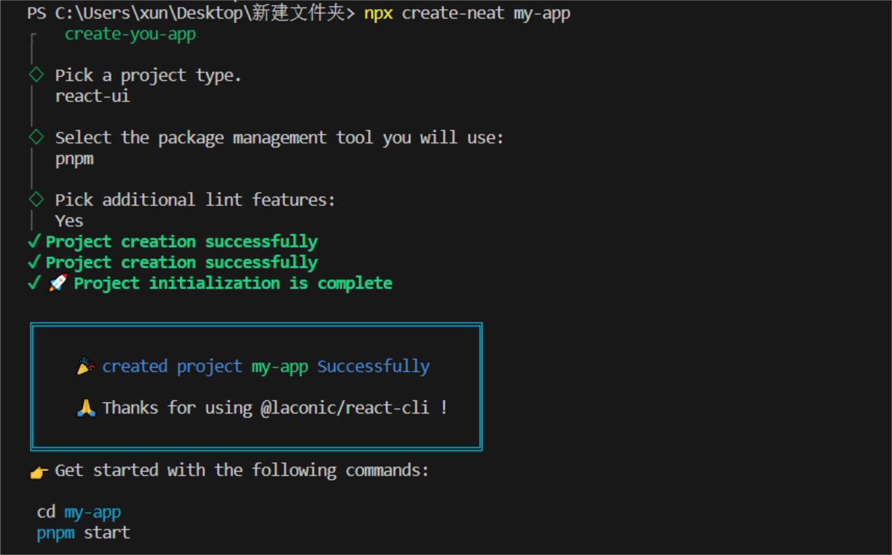

<h1 align="center" style="font-size: 2.5em; color: #333;">Create-Neat</h1>
<hr style="border: 1px solid #ccc;"/>

<p align="center" style="font-size: 1.2em; color: #555; max-width: 800px; line-height: 1.5;">
    <strong>Create-Neat</strong> 是一款轻量级脚手架工具，专为提供
    <span style="color: #007BFF;">开箱即用</span>和
    <span style="color: #007BFF;">零配置</span>体验而设计，旨在帮助用户快速且轻松地构建项目，同时支持多样的技术栈选择。
</p>


### 一、背景 📖

当前社区中已有众多优秀的前端脚手架工具，如 create-vite、create-next-app 和 create-react-app 等。这些工具在设计上确实优秀且强大，但仍然面临两个主要问题：
- **黑盒环境**：新手在使用这些工具时，配置过程较为复杂，存在较高的学习成本和心智负担。
- **灵活性不足**：许多脚手架工具仅专注于特定技术栈，若需要集成其他技术栈，往往需寻找额外的脚手架。

[Create-Neat](https://create-neat.github.io/docs/) 旨在解决上述问题，使开发者能够快速创建项目，无需担心复杂的配置，同时提供广泛的技术栈选择 🚀🚀🚀。

### 二、关于我们 🧰

#### 核心特点
- 📦 **零配置，开箱即用。**
- 🚀 **插件式项目生成**：根据用户需求灵活生成不同基础项目。
- 🧠 **支持无限扩展的架构**：框架、构建工具和插件的潜力无限。
- 💯 **丰富的使用教程和代码注释**：帮助每位社区成员快速学习前端工程化相关知识。
- 👌 **完善且细致的贡献流程**：手把手指导从学习到贡献的过程。
- 🔸 **更多特性等待你的贡献！**
#### 社区支持
- 🌈 **活跃的社区氛围**：提供丰富的技术交流和学习资源，帮助开发者快速成长。
- ⚙️ **定期更新与维护**：定期更新工具，修复bug、完善功能、加入新的技术栈支持。
- 🎉 **用户友好的体验**：专注于用户体验，力求让每一位用户都能享受到流畅、无阻的开发过程。

### 三、快速开始 🚩

#### 安装依赖
```shell
npm install -g create-neat
```

#### 创建项目
```shell
create-neat <project-name>
```

输入命令 `create-neat my-app` 后，控制台将提供以下功能选择:

```markdown
create-you-app

♦ Please pick a preset:
● Default-lib ( `[common-lib]` eslint, babel, webpack )
○ Default-vue ( `[vue]` eslint, babel, webpack )
○ Default-react ( `[react]` eslint, babel, webpack )
○ Manually select preset
```

根据需求选择对应框架，或通过 `Manually select preset` 进行自由组合。`create-neat` 将根据选择的预设创建不同的开箱即用应用程序，选项包括：

- **框架**：`react`、`vue` 或 `类库/工具库`。
- **构建工具**：`webpack`、`vite` 等。
- **插件**：`eslint`、`prettier`、`typescript`、`babel`、`swc` 等。
- **其他选项**：包管理器、镜像源等。

这些选项通过我们的设计抽象层，在生成器架构中创建最终项目。

若项目创建成功，可查看如下效果图：



#### 启动项目
```shell
cd <project-name>
npm start
```

至此，你可以开始项目的开发了！如欲深入了解项目启动方式、架构等细节，欢迎加入我们的社区群或查阅文档网站（建设中）。

### 四、贡献者 👊

感谢以下贡献者的支持，诚邀更多技术大佬加入我们的行列！

<a href="https://github.com/xun082/create-neat/contributors">
    
</a>

### 五、贡献指南 📑

[查看贡献指南文档](https://rwndk8l22n.feishu.cn/docx/IF5id8KlPo7pNAxff5Ic2W8bnzf)

### 六、加入我们 🔗

> 如果您正在使用这个项目或者对这个项目感兴趣，可以通过以下方式支持我们:
- **Star、Fork、Watch** 一键三连 🚀🚀🚀
> 我们很乐意在 `create-neat` 中得到您的帮助，看到您的贡献，如果你想获取到更多信息以及如何开始，欢迎通过添加微信号`Tongxx_yj`/`yunmz777`加入我们!

